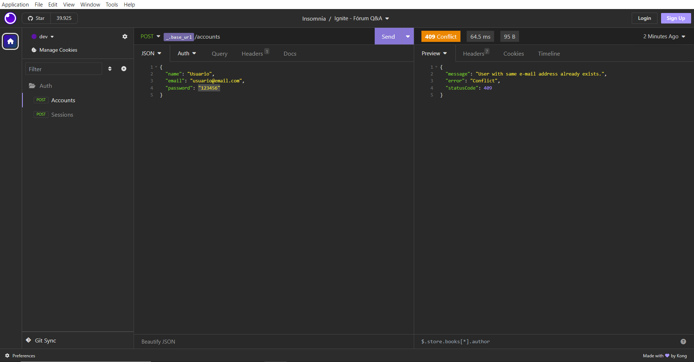

<div align="center">
  
</div>

<h3 align="center">
  Fórum Q&A API
</h3>

<p align="center">API de um fórum de perguntas e respostas, similar ao Stack Overflow. Usuários podem se registrar, criar perguntas, respondê-las, comentar em perguntas e respostas. Construído com NestJS e seguindo os princípios de Clean Architecture</p>

<p align="center">
  <a href="#como-executar-o-projeto">Como executar o projeto</a>&nbsp;&nbsp;&nbsp;|&nbsp;&nbsp;&nbsp;
  <a href="#sobre">Sobre</a>&nbsp;&nbsp;&nbsp;|&nbsp;&nbsp;&nbsp;
  <a href="#anotações">Anotações</a>
</p>

<p align="center">Back-end</p>

<p align="center">
  
</p>

## Como executar o projeto

### Clonar este repositório

```bash
git clone https://github.com/eliasmcastro/rocketseat-ignite-nodejs-forum-api.git
```

### Requisitos

- [Node.js](https://nodejs.org) na versão 24.18.1 com `npm` na versão 11.16.0
  - [Como instalar o Node.js](https://github.com/eliasmcastro/guia-instalacao-ferramentas#nodejs--nmv)

- [Docker](https://www.docker.com/get-started) para o banco de dados
  - [Como instalar o Docker](https://github.com/eliasmcastro/guia-instalacao-ferramentas#docker-e-docker-compose)

#### Opcional

- [Insomnia](https://insomnia.rest)

### Passos para a execução

- Instalar as dependências do projeto

  ```bash
  npm i
  ```

- Configurar as variáveis de ambiente no arquivo `.env`, utilizando o `.env.example` como referência

- Iniciar o banco de dados com Docker

  ```bash
  docker-compose up -d
  ```

- Executar as migrations do Prisma

  ```bash
  # Executar as migrations
  npx prisma migrate dev

  # Gerar cliente
  npx prisma generate
  ```

- Acessar o Prisma Studio

  ```bash
  npx prisma studio
  ```

  URL para acessar o Prisma Studio: http://localhost:51212

- Executar a aplicação (modo de desenvolvimento)

  ```bash
  npm run start:dev
  ```

  A aplicação começará a ser executada em http://localhost:3333

  _Dica: utilizar o Insomnia para testar as rotas_: Abrir o Insomnia -> Application -> Preferences -> Data -> Import Data -> From File -> Selecionar o arquivo insomnia.json

- Executar a aplicação (modo de produção)

  ```bash
  # Gerar o build
  npm run build

  # Iniciar a aplicação em modo de produção
  npm run start:prod
  ```

- Executar testes

  ```bash
  # Testes unitários (unit)
  npm run test

  # Testes de integração (E2E)
  npm run test:e2e
  ```

## Sobre

### Tecnologias

- **Framework:** [NestJS](https://nestjs.com/)
- **Linguagem:** [TypeScript](https://www.typescriptlang.org/)
- **ORM:** [Prisma](https://www.prisma.io/)
- **Banco de Dados:** [PostgreSQL](https://www.postgresql.org/) (utilizado com Prisma)
- **Autenticação:** [JWT](https://jwt.io/) (JSON Web Tokens)
- **Testes:** [Vitest](https://vitest.dev/)
- **Cache:** [Redis](https://redis.io/)
- **Upload de Arquivos:** Suporte para upload de arquivos (ex: R2 Storage)
- **Linting:** [ESLint](https://eslint.org/)
- **Validação:** [Zod](https://zod.dev/)

### Arquitetura

O projeto segue os princípios da **Clean Architecture**, separando o código em quatro camadas principais:

- `src/core`: Contém a lógica de negócio mais genérica e os blocos de construção do domínio (Entidades, Value Objects, Use Cases, etc.).
- `src/domain`: Contém a lógica de negócio específica da aplicação, dividida por contextos (ex: `forum`, `notification`).
- `src/infra`: Contém os detalhes de implementação, como controladores HTTP, módulos do NestJS, acesso ao banco de dados, etc.
- `test`: Contém os testes da aplicação, incluindo testes unitários e end-to-end.

### Rotas da API (Endpoints)

A seguir, a lista de rotas disponíveis na API:

#### Autenticação

- `POST /sessions`: Autentica um usuário e retorna um `access_token`.
- `POST /accounts`: Cria uma nova conta de usuário.

#### Perguntas

- `POST /questions`: Cria uma nova pergunta.
- `GET /questions`: Lista as perguntas mais recentes.
- `GET /questions/:slug`: Busca uma pergunta pelo seu slug.
- `PUT /questions/:id`: Edita uma pergunta.
- `DELETE /questions/:id`: Deleta uma pergunta.

#### Respostas

- `POST /questions/:questionId/answers`: Adiciona uma resposta a uma pergunta.
- `GET /questions/:questionId/answers`: Lista as respostas de uma pergunta.
- `PUT /answers/:id`: Edita uma resposta.
- `DELETE /answers/:id`: Deleta uma resposta.
- `PATCH /answers/:answerId/choose-as-best`: Marca uma resposta como a melhor.

#### Comentários

- `POST /questions/:questionId/comments`: Adiciona um comentário a uma pergunta.
- `GET /questions/:questionId/comments`: Lista os comentários de uma pergunta.
- `DELETE /questions/comments/:id`: Deleta um comentário de uma pergunta.
- `POST /answers/:answerId/comments`: Adiciona um comentário a uma resposta.
- `GET /answers/:answerId/comments`: Lista os comentários de uma resposta.
- `DELETE /answers/comments/:id`: Deleta um comentário de uma resposta.

#### Anexos

- `POST /attachments`: Faz o upload de um anexo.

#### Notificações

- `PATCH /notifications/:notificationId/read`: Marca uma notificação como lida.

## Anotações

### Criando um projeto

Antes de começar a desenvolver uma aplicação com **NestJS**, é necessário instalar a ferramenta de linha de comando (CLI), que simplifica a criação e o gerenciamento de projetos. Após a instalação, é possível gerar um novo projeto com uma estrutura inicial pronta para uso, contendo as configurações e dependências básicas.

- `npm i -g @nestjs/cli` instala a interface de linha de comando (CLI) do NestJS globalmente no seu computador.
- `nest new project-name` cria um novo projeto NestJS.

### Configurando ESLint e Prettier

O **ESLint** ajuda a manter um padrão de código no projeto, identificar possíveis problemas e aplicar correções automáticas.

- `npm i eslint@8.57.1 @rocketseat/eslint-config -D` instala as dependências necessárias.
- Criar o arquivo `.eslintrc.json` na raiz do projeto com o seguinte conteúdo:

  ```json
  {
    "extends": ["@rocketseat/eslint-config/node"],
    "rules": {
      "no-useless-constructor": "off"
    }
  }
  ```

- Criar o arquivo `.editorconfig` na raiz do projeto para defir padrões de formatação para o editor.

  ```ini
  root = true

  [*]
  indent_style = space
  indent_size = 2
  charset = utf-8
  trim_trailing_whitespace = true
  insert_final_newline = true
  end_of_line = lf
  ```

- Instale a extensão `ESLint` no VS Code.
- Abra as configurações do VS Code em formato JSON:
  - Pressione `CTRL + SHIFT + P`.
  - Pesquise por `Open User Settings (JSON)`.
  - Adicione as seguintes configurações:

    ```json
    {
      "editor.formatOnSave": true, // Formata o arquivo automaticamente ao salvar
      "editor.defaultFormatter": "esbenp.prettier-vscode", // Define o Prettier como formatador padrão
      "editor.codeActionsOnSave": { "source.fixAll.eslint": "explicit" } // Executa automaticamente as correções sugeridas pelo ESLint ao salvar o arquivo
    }
    ```

- Para verificar ou corrigir todo o projeto manualmente, execute `npm run lint`.

### Docker e Docker Compose

O **Docker** é uma plataforma que permite criar e executar aplicações em contêineres, garantindo um ambiente isolado e consistente. O **Docker Compose** é uma ferramenta que permite definir e gerenciar múltiplos contêineres Docker por meio de um único arquivo de configuração.

- Criar um arquivo chamado `docker-compose.yml` para definir as configurações da aplicação e dos serviços que serão executados pelos contêineres.
- `docker-compose up -d` para criar e iniciar os containers definidos no `docker-compose.yml`, liberando o terminal.

Principais comandos:

  - `docker ps` para visualizar apenas os containers em execução.

  - `docker ps -a` para visualizar todos os containers (em execução e parados).

  - `docker exec -it ${nomeContainer} /bin/bash` para acessar um container.
    - CTRL + D para sair

  - `docker logs -f ${nomeContainer}` para acompanhar os logs de um container.

  - `docker start ${nomeContainer}` para iniciar um container.

  - `docker stop ${nomeContainer}` para parar um container.

  - `docker rm ${nomeContainer}` para remover um container.

  - `docker images` para listar as imagens.

  - `docker rmi ${nomeImagen}` para remover uma imagem.

  - `docker-compose up -d` para criar e iniciar os containers definidos no `docker-compose.yml`, liberando o terminal.

  - `docker-compose up --force-recreate -d` para recriar os containers e iniciá-los, liberando o terminal.

  - `docker-compose start` para iniciar os containers existentes.

  - `docker-compose stop` para parar os containers.

  - `docker-compose down` para remover os containers e a rede criada pelo Compose.

  - `docker-compose down -v --rmi local` para remover os containers, a rede, os volumes e as imagens criadas pelo Compose.

### Prisma

O **Prisma** é um ORM (Object-Relational Mapping) para Node.js e TypeScript que facilita o acesso e a manipulação de bancos de dados usando código, sem precisar escrever muito SQL.

Sugestão: instale a extensão Prisma no Visual Studio Code para facilitar a edição do arquivo `schema.prisma`, com autocompletar, formatação e validação.

- `npm i prisma@7.2.0 -D` instala o Prisma CLI, usada para criar migrations, gerar o cliente e gerenciar o banco.

- `npm i @prisma/client@7.2.0` instala o cliente prisma utilizado pela aplicação para acessar o banco de dados.

- `npm i @prisma/adapter-pg@^7.2.0` instala o adaptador oficial do Prisma para PostgreSQL, responsável por conectar o Prisma Client ao banco de dados utilizando o driver pg.

- `npm i pg@^8.16.3` instala o driver oficial do PostgreSQL para Node.js, que realiza a comunicação entre a aplicação e o banco de dados.

- `npx prisma init` inicializa o Prisma no projeto, criando a pasta `prisma`, o arquivo `schema.prisma` (onde são definidos os modelos, o provedor do banco de dados e a configuração do Prisma) e o arquivo `prisma.config.ts`, responsável pela configuração do Prisma CLI. Também cria ou atualiza o arquivo `.env` com a variável `DATABASE_URL`, caso ele ainda não exista.

- `npx prisma migrate dev` cria uma nova migration com base nas alterações feitas no arquivo `schema.prisma`, aplica essa migration ao banco de dados e atualiza o Prisma Client automaticamente.

- `npx prisma generate` gera ou atualiza o Prisma Client com base no arquivo `schema.prisma`, refletindo todas as alterações feitas nos modelos.

- `npx prisma studio` abre o Prisma Studio, uma interface gráfica para visualizar e gerenciar os dados do banco de dados.
  - URL para acessar o Prisma Studio: http://localhost:51212

### Debugando a aplicação pelo VS Code

- Inicie a aplicação em modo de debug: `npm run start:debug`.
- No VS Code, abra a aba `Run and Debug`. Em seguida, clique em `create a launch.json file` e, quando solicitado, selecione `Node.js`.
- Substitua o conteúdo gerado pela configuração abaixo:

  ```json
  {
    "version": "0.2.0",
    "configurations": [
      {
        "type": "node",
        "request": "attach",
        "name": "NestJS Debug",
        "port": 9229,
        "restart": true,
        "skipFiles": ["<node_internals>/**"]
      }
    ]
  }
  ```
- Abra a aba `Run and Debug`, selecione a configuração `NestJS Debug` e clique em `Start Debugging` (ou pressione F5).
- Adicione breakpoints nos pontos do código onde deseja realizar o debug.

### Criptografrar senha

O **bcryptjs** é uma biblioteca usada para criptografar senhas antes de armazená-las no banco de dados.

- `npm i bcryptjs` para instalar o bcrypt

### Validação de dados

O **Zod** é uma biblioteca que permite definir esquemas e validar dados (strings, números, objetos, arrays, etc.). Já o **zod-validation-error** converte os erros detalhados do Zod em mensagens mais simples e legíveis.

- `npm i zod zod-validation-error` instala o zod e zod-validation-error
